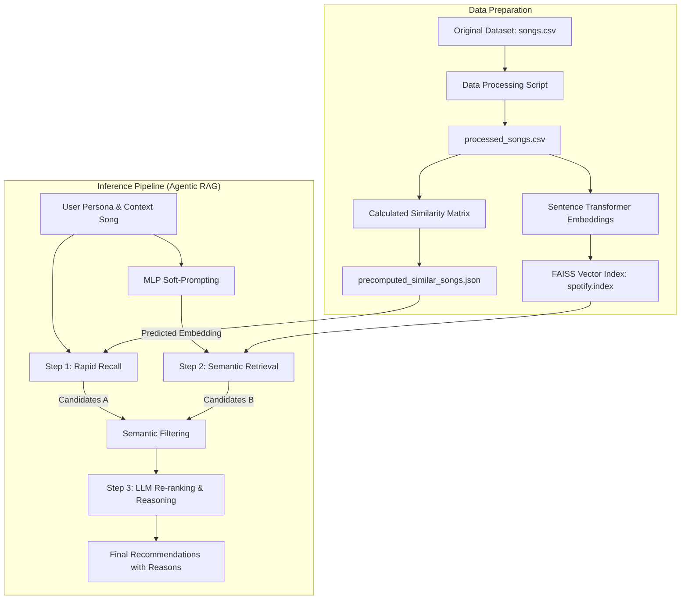

# 🎵 Spotify Agentic RAG: 系統架構與技術資產

本文件詳細記錄了 **Spotify Agentic RAG** 系統的架構設計、推理邏輯以及相關技術資產。本系統旨在模擬人類專家（如資深 DJ）的思考過程，提供具備「理性推理」能力的音樂推薦。

---

## 🧠 系統架構槪覽

本系統採用 **Agentic RAG (Retrieval-Augmented Generation)** 架構，結合了傳統推薦演算法的效率與大型語言模型 (LLM) 的語義理解能力。

### 核心資料流 (Data Flow)

---

## ⚙️ 三階段推理管線 (The 3-Step Pipeline)

系統的推薦過程被拆解為三個階段，這使得 Agent 的思考過程具備透明度與可解釋性。

### Step 1: Candidates from Pre-computed Similar Items (快速檢索)

- **目標**: 以極高效率從百萬級數據中縮小範圍。
- **技術**: 使用共現矩陣 (Co-occurrence) 或音訊特徵 (Tempo, Energy, Valence) 計算相似度。
- **資產**: 依賴 `data/precomputed_similar_songs.json`。
- **輸出**: 產生約 20-50 首聽感相似的基礎候選集。

### Step 2: Candidates from Vector DB Semantic Search (語義過濾與補充)

- **目標**: 透過「語義」感知歌曲風格、氛圍與 Metadata 間的隱性關聯。
- **技術**:
  - **MLP Soft-Prompting**: 預測目標歌曲在語義空間中的 Embedding。
  - **Vector Search**: 使用 FAISS 尋找最接近的語義向量。
- **資產**: 依賴 `data/spotify.index` 與 `data/soft_prompt_mlp.pth`。
- **輸出**: 篩選並補充更具風格一致性的候選歌曲。

### Step 3: LLM Re-ranking & Reasoning (深度推理與決策)

- **目標**: 模擬人類專家根據 User Persona 進行最後裁決。
- **技術**: 將候選清單打包送往 LLM (GPT-4o, Gemini 2.0, 或 Grok 4.1)。
- **功能**:
  - 根據 Persona (如 "Lo-fi Reader") 進行排序。
  - 生成具說服力的推薦理由 (Reasoning)。
- **資產**: 呼叫 OpenRouter 整合之多模型介面。

---

## 📂 技術資產清單 (Technical Assets Inventory)

### 1. 資料資產 (Data Assets)

| 檔案路徑                              | 類型       | 說明                           |
| :------------------------------------ | :--------- | :----------------------------- |
| `data/songs.csv`                      | 原始資料   | 包含歌曲 Metadata 與音訊特徵。 |
| `data/processed_songs.csv`            | 處理後資料 | 經特徵縮放與編碼後的乾淨數據。 |
| `data/precomputed_similar_songs.json` | 檢索快取   | 預先計算的歌曲相似度對照表。   |
| `data/rag_docs.csv`                   | 語義文本   | 用於向量化檢索的歌曲描述文本。 |

### 2. 模型與索引資產 (Model & Index Assets)

| 檔案路徑                      | 技術    | 說明                                        |
| :---------------------------- | :------ | :------------------------------------------ |
| `data/spotify.index`          | FAISS   | 基於 Sentence Transformers 的高維向量索引。 |
| `data/soft_prompt_mlp.pth`    | PyTorch | MLP 模型權重，將音訊特徵映射至語義空間。    |
| `data/spotify_faiss_meta.pkl` | Pickle  | FAISS 索引對應的歌曲 Metadata 映射。        |

### 3. 核心程式資產 (Code Assets)

| 腳本名稱       | 路徑                           | 核心職責                           |
| :------------- | :----------------------------- | :--------------------------------- |
| **資料處理**   | `scripts/data_processing.py`   | 負責特徵工程、Log 轉換與 Scaling。 |
| **模型訓練**   | `scripts/train_mlp.py`         | 訓練 Soft-Prompt 映射模型。        |
| **向量建置**   | `scripts/indexing_faiss.py`    | 建構 FAISS 向量資料庫與索引。      |
| **推理大腦**   | `scripts/recommender_agent.py` | 封裝 LLM 推理邏輯與多模型對比。    |
| **主應用程式** | `app.py`                       | Streamlit 使用者介面與流程調度。   |

---

## 🛠️ 技術堆疊 (Technology Stack)

- **前端介面**: Streamlit
- **資料處理**: Pandas, NumPy, Scikit-learn
- **深度學習**: PyTorch (MLP)
- **向量檢索**: FAISS, ChromaDB
- **語言模型**: OpenAI GPT-4o-mini, Google Gemini 1.5 Pro, xAI Grok
- **視覺化**: Plotly (PCA 降維空間展示)
- **反饋機制**: Google Sheets API (使用者投票與日誌)

---

## 📊 視覺化輔助: PCA Embedding Space

系統透過 **Principal Component Analysis (PCA)** 將高維語義向量降維至 2D 空間，讓用戶直觀觀察 Agent 的檢索軌跡：

- **藍點**: Persona 歷史偏好歌曲。
- **橘點**: 被選中的候選歌曲。
- **紅點**: 最終推薦歌曲。

這不僅增強了信任感，也讓 RAG 過程不再是黑箱。

---

_文件更新日期: 2026-04-23_
